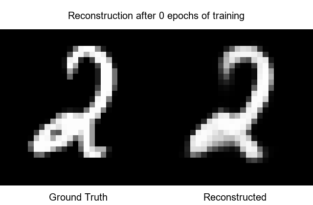

# AutoEncoder Implementation for Image Reconstruction from scratch

This repo constructs various architectures of AutoEncoders Models for Image Reconstruction.

## Visaulization of the image reconstruction across the eopchs during training:

  

## What are Autoencoders?

An autoencoder is a neural network that learns to compress an image into a smaller representation (called the latent space) and then reconstruct the original image from that compressed version.
It has two parts:

1. Encoder

        Takes the input image, gradually reduces its dimensionality, learns a compact
        encoded vector (latent code) that captures the most important features

3. Decoder

        Takes the latent code, reconstructs the image back to its original shape.

The goal is the trained network to minimize the difference between the **input image** and the reconstructed one.

What autoencoders are used for:
- Denoising images
- Data Compression
- Anomaly detection
- Feature learning for usage in other tasks.

